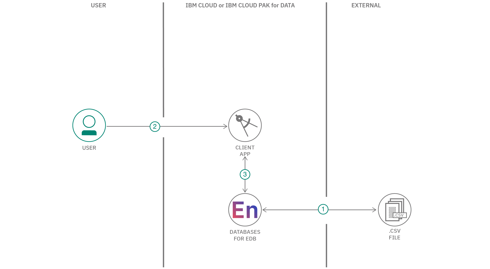
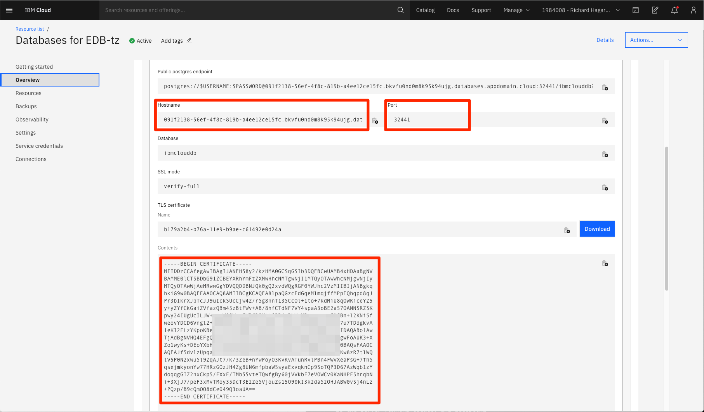
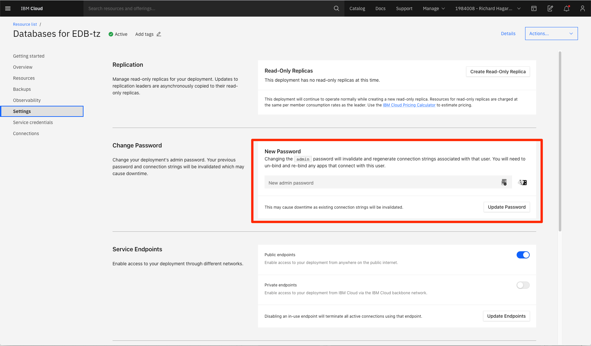
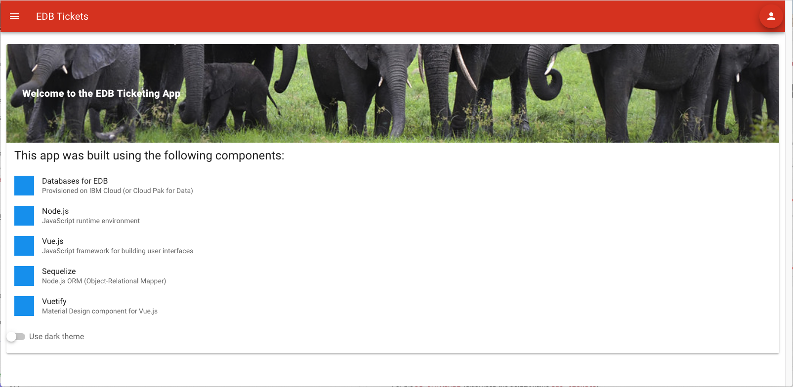
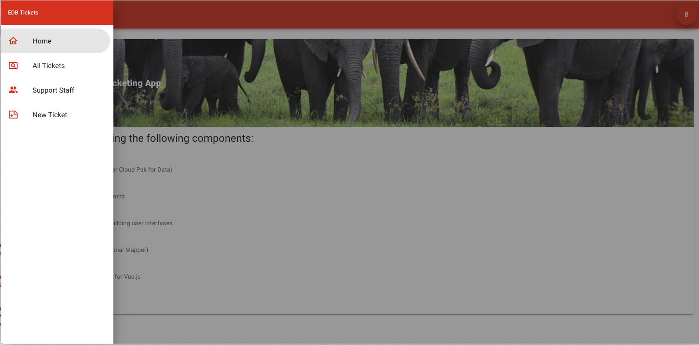
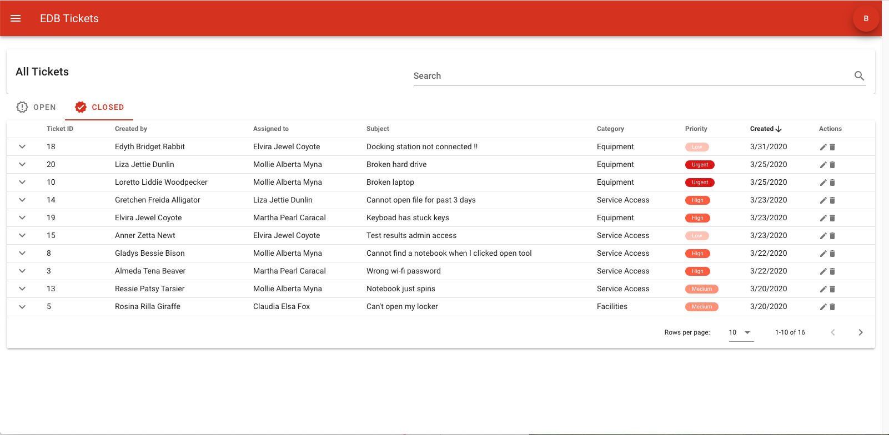
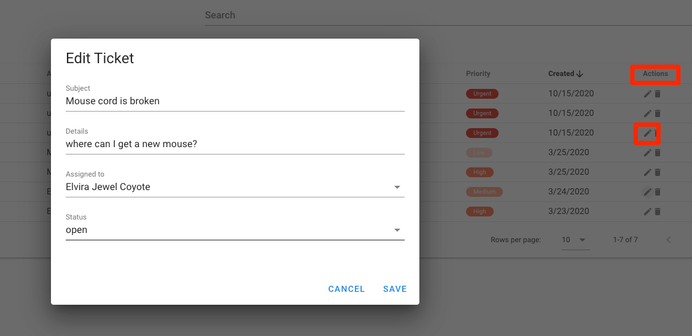
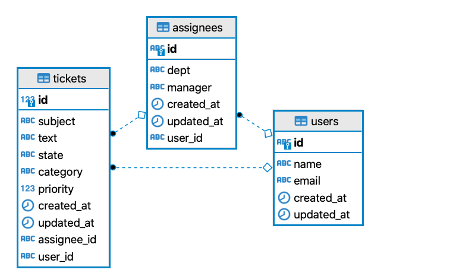

[](https://travis-ci.org/IBM/edb-tickets)

# Develop a modern web app using EDB, an enterprise-class PostgreSQL database-as-a-service

In this code pattern, we walk you through a working example of a web application that tracks a company's internal support ticket system. The app will allow users to create, assign, manage, and close support tickets.

All support tickets, users, and support staff will be maintained in a `Databases for EDB` deployment provisioned on IBM Cloud. `EDB` is a PostgreSQL-based database that provides features such as: high availability, automated backup orchestration, and de-coupled scaling of storage, RAM, and vCPUs.

Other featured technologies in this code pattern include:

* [Sequelize](https://sequelize.org/): A Node.js Object-Relational Mapper (ORM) for EDB, Postgres, MySQL, and other relational databases.
* [Node.js](https://nodejs.org): An open-source JavaScript run-time environment for executing server-side JavaScript code.
* [Express](https://expressjs.com/): A popular and minimalistic web framework for creating an API and Web server.
* [Vue](https://vuejs.org/): A JavaScript framework for building web app user interfaces.
* [Vuetify](https://vuetifyjs.com): A Material Design component framework for Vue.js apps.
* [psql](): A command-line interface utility for managing PostgreSQL databases.

When you have completed this code pattern, you will understand how to:

* Provision an `EDB for Databases` instance on IBM Cloud.
* Use `Sequelize` to programmatically map objects to your relational database.
* Create a modern web app built on Node.js, with an `Express` server for REST APIs, and a `Vue`-based UI.
* Use `psql` scripts to seed the database tables with tickets, users, and support staff.



## Flow

1. Administrator uses `psql` to seed `EDB` tables with user, assignee, and ticket data.
1. User interacts with the `Node.js` app to create and maintain ticket information. The `Vue`-based client UI accesses EDB data via the `Express` server REST APIs.
1. The server uses `Sequelize` to perform CRUD operations on the EDB instance.

## Steps

1. [Clone the repo](#1-clone-the-repo)
1. [Provision the Databases for EDB service](#2-provision-the-databases-for-edb-service)
1. [Add service credentials to environment file](#3-add-service-credentials-to-environment-file)
1. [Load some historical data](#4-load-some-historical-data)
1. [Run the application](#5-run-the-application)
1. [Use the app](#6-use-the-app)
1. [Application structure](#-7-application-structure)

## 1. Clone the repo

Clone the **edb-tickets** repo locally. In a terminal, run:

```zsh
git clone https://github.com/IBM/edb-tickets
cd edb-tickets
```

> Note: Example commands below will assume you ran the `cd edb-tickets` command to start from the base directory of your cloned repo.

## 2. Provision the "Databases for EDB" service

* If you do not have an IBM Cloud account, register for a free trial account [here](https://cloud.ibm.com/registration)
* Create a `Databases for EDB` instance from the [IBM Cloud catalog](https://cloud.ibm.com/catalog/services/databases-for-enterprisedb)
  * Verify the default region, and modify the instance name if you like.
  * Keep all other default options and values.

## 3. Add service credentials to environment file

Copy the local `env.sample` file and name it `.env`:

```bash
cp env.sample .env
```

You will need to update the `.env` file with the credentials from your EDB service. Here is an example `.env` file showing the credentials you will need to collect:

```bash
# Copy this file to .env and replace the credentials with
# your own before starting the app.

DB_USERNAME=admin
DB_PASSWORD=*******
DB_DATABASE=edb-tickets
DB_HOST=Aaa12345-ed12-45d6-aa63-0d2a83dcc93b.bn2a2uid0de8vv7mv2ig.databases.appdomain.cloud
DB_PORT=32465
DB_CERTFILE=/users/username/edb-cert
```

To find your `DB_HOST` and `DB_PORT` values, navigate to your EDB service panel and click the `Overview` tab.



Copy and paste the `Certificate` into a local file, and provide the name as the `DB_CERTFILE` value.

For convenience, we're using the `admin` account as the `DB_USERNAME`. To set the `DB_PASSWORD` for the `admin` account, use the `Update Password` option located in the `Settings` tab.



> NOTE: You can create additional credentials...
> * Use `Service credentials` in the left menu.
> * Click on `New credential +`.
> * Once created, use the expand icon and copy the parts you need.

For the `DB_DATABASE` value, keep the default name `edb-tickets` or choose your own name. The service is provisioned with a database named `ibmclouddb`, but we can create a new one.

## #.? Create the database

You already configured your database connection details in the **.env** file. In `config/config.js`, we create a connection for Sequelize by reading that **.env** file to set our process environment variables, and then using them in the structure needed for Sequelize.

```javascript
const fs = require('fs');
require('dotenv').config();

module.exports = {
  development: {
    username: process.env.DB_USERNAME,
    password: process.env.DB_PASSWORD,
    database: process.env.DB_DATABASE,
    host: process.env.DB_HOST,
    port: process.env.DB_PORT,
    dialect: "postgres",
    dialectOptions: {
      ssl: {
        ca: fs.readFileSync(process.env.DB_CERTFILE)
      }
    }
  }
};
```

This will be used when our app connects to the database, but we can also use it now to create a database using Sequelize.

Run the following commands to:

1. Run `npm init` to install packages required by the app. This includes Sequelize which we can run from the command-line.
2. Run `npx sequelize db:create` to create your database.

```bash
npm init
npx sequelize db:create
```

## #.? Create the tables

Our app uses Sequelize to check the database for the expected tables. It will create them for you on startup, but let's use the command-line to do it first.

We created the models using Sequelize and our code uses the models instead of writing SQL or using a database-specific API. The code for the models is in the **models** directory. Sequelize is already configured to use those models, so we can create the tables with this simple command:

```bash
sequelize ???  maybe not  ???
```

## X.? Using the app

```bash
npm run serve

## 4. Load sample data

You can create, edit, assign, and close your own tickets using the app.

If you would like to start with some sample data, we have created a `psql` script to seed the database with users, support staff, and tickets. Instructions can be found the [README](data/README.md) file located in the `/data` directory.

### Load tickets into the database from CSV files using `psql`

#### Prerequisites

You should follow the main [../README.md](../README.md) to setup and start the app. When the app starts it will connect to the database and create the tables. The instructions below assume the tables have already been created using this method.

> TODO: Should we provide scripts for this also? It might be interesting.

### Install psql

The command-line tool `psql` is what we use to run our data loading script.

#### Install it

https://cloud.ibm.com/docs/databases-for-enterprisedb?topic=databases-for-enterprisedb-connecting-psql

#### On MacOS:

```bash
brew install libpq
brew link --force libpq
```

> NOTE: This broke my npm/node.  I had to brew update npm afterwards.

### Load the sample data

The UI and database are ready if you followed the above steps.  You can start entering new tickets. For some additional sample data, we have provided some old data that you can load into the database to have some history to show:

Export the same connection info that you put in .env as a convenience for the command that follows.

```bash
# . ./.env # TODO: this does not work. need exports like this...
export DB_DATABASE=edb-tickets
export DB_USERNAME=admin
export DB_HOST=AAAAAAAA-1234-5678-aaaa-945735783957983574574574308753457.databases.appdomain.cloud
export DB_PORT=32465
```

<!-- 
### Create the database (can we move this to the main README?)

> Note:  If you haven't created the database yet (then you didn't follow the instructions) you can just connect to the `postgres` database and run `CREATE DATABASE testdb1; quit;`.  Here is a script to do it.
```bash
psql -h $DB_HOST -p $DB_PORT -U $DB_USERNAME postgres -v dbname=$DB_DATABASE -f data/createdb.sql
```
> Tip: The output says `CREATE DATABASE` when it is successful.
-->

From your local repo's **edb-tickets** directory, use **psql** to run the script in [data/load.sql](load.sql) using your connection credentials.

```bash
psql -h $DB_HOST -p $DB_PORT -U $DB_USERNAME $DB_DATABASE -f data/load.sql
```

### TODO: Show what it does... yada yada

### psql tips

For an interactive session in the psql query tool, run the command without an input file (no -f).

```bash
psql -h $DB_HOST -p $DB_PORT -U $DB_USERNAME $DB_DATABASE
```

* PSQL TIP: You can store your password somewhere to avoid prompting.

* PSQL TIP: end SQL with a semi-colon for it to run in psql

* PSQL TIP: Use `exit` or `quit` to end your session.

## 5. Run the application

1. Install the [Node.js](https://nodejs.org/en/) runtime.
1. Build and start the app by running the following commands:

   ```bash
   npm install
   npm run build
   npm start
   ```

1. The application will be available in your broswer at [http://localhost:8080](http://localhost:8080).



When the app starts it will connect and sync to the database. If needed, you can modify the code to drop the database tables and start fresh. The code is located in **app.js** file.

```javascript
(async () => {
  // Clobber and recreate the tables for testing
  //await models.sequelize.sync({ force: true });

  // Don't clobber the tables, but alter and migrate if needed
  await models.sequelize.sync({ alter: true });
})();
```

### For UI Developers

1. Run the command shown above to start the server with the REST API and a build of the UI.
1. Run the command below to start a `development server` so you can work on the UI and see your changes.
1. The `development server` will take the next available port so it should be accessible at http://localhost:8081.
1. Keep in mind that when using this development app, it will still rely on the REST services provided by the server running on port `8080`.

```bash
npm run serve
```

## 6. Use the app

The app is a typically help desk application that tracks tickets for service requests. Users create the ticket, the ticket is assigned to a member of the support staff, and the ticket can be updated with current status as it progresses to being completed and closed.

Anyone who logs into the app is considered a valid user, and will be added to the database as such. Any valid user can add or modify tickets, but only support staff personnel can be assigned to work on a ticket.

To start, you will need to login to the app by clicking the avatar located in the top right corner of the home page. Since this data will be stored in the EDB cloud service, we suggest using an alias for username and email.

Once logged in, you will now have access to all of the menu options.

> **NOTE**: You will not be able to create a ticket until you log in.



The `All Tickets` menu option displays all tickets in the database. Tabs are used to seperate out `Open` and `Closed` tickets.



The `Support Staff` menu option displays all users who are designated as support staff. This are the only users who can be assigned a ticket.

The `New Ticket` menu option displays a form you can use to create a ticket. Here you are required to enter a `Subject` and `Description`, and select a `Category` and `Priority`. The new ticket will automatically assign you as the `created by` user.

To assign a support staff member to work on the ticket, `Edit` the ticket by clicking the `pencil` icon shown in the `Actions` column for the ticket in the `All Tickets` panel.



From the `Edit Ticket` panel you can also change the current status, and other ticket details.

To delete a ticket, click the `trashcan` icon shown in the `Actions` column for the ticket in the `All Tickets` panel.

## 7. Application structure

### Database support

Each of the database tables in `EDB` will be descibed by their respective files found in the `/models` directory. The files specify the field names and any relationships that exist between tables.

Files located in the `/controllers` directory define what access the server has to the database tables, and how to perform that access.

Here is an entity-relationship diagram of the tables in our `EDB` database. A ticket is linked to a user (who created the ticket) by `user_id`, and to an assignee by `assignee_id`. An assignee is linked to a user by `user_id`.



NOTE: in `/controllers/ticket.js`, you will see the `Sequelize` command `Upsert` used when a ticket is added. This insures that the `created by` user exists in the user table. If they do not, the user is added at the same time as the ticket. This ensures data integrity.

### Express routing

The `Express` framework is used to define route paths in the server.

Files found in the `/routes` directory set up the REST endpoints for accessing the data in each of the `EDB` tables.

### Vue components

`Vue` components are used to build the app UI, and can be found in the `/src` directory.

The main `Vue` component is `App.vue`, which defines the page banner, the login panel, and navigation links to the sub-pages.

Each sub-panel in the app has its own `Vue` file, which is located in the `/src/pages` directory.

Re-usable sub-components can be found in the `/src/compenents` directory.

## License

This code pattern is licensed under the Apache License, Version 2. Separate third-party code objects invoked within this code pattern are licensed by their respective providers pursuant to their own separate licenses. Contributions are subject to the [Developer Certificate of Origin, Version 1.1](https://developercertificate.org/) and the [Apache License, Version 2](https://www.apache.org/licenses/LICENSE-2.0.txt).

[Apache License FAQ](https://www.apache.org/foundation/license-faq.html#WhatDoesItMEAN)
